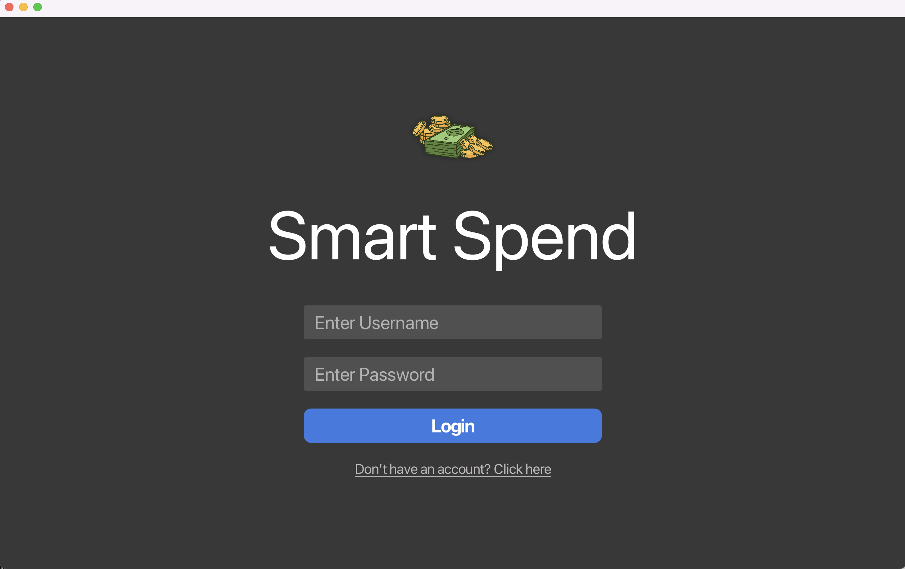
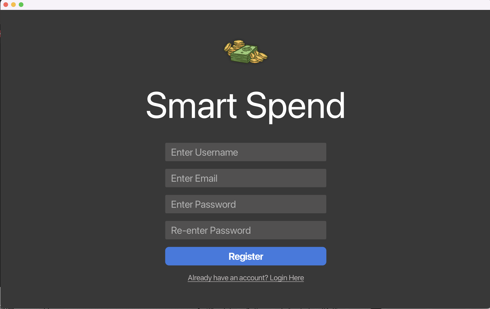
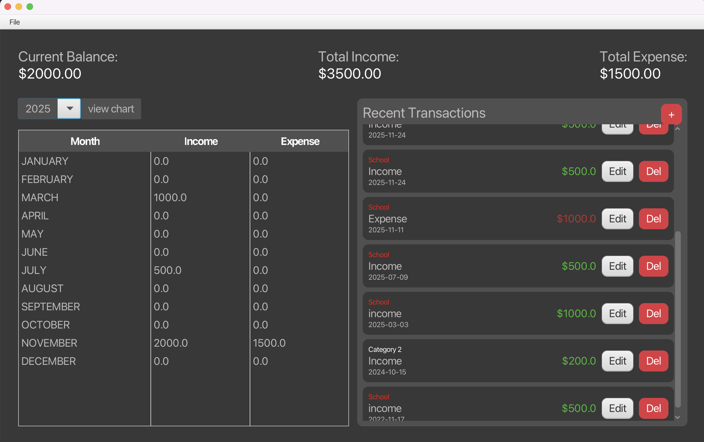
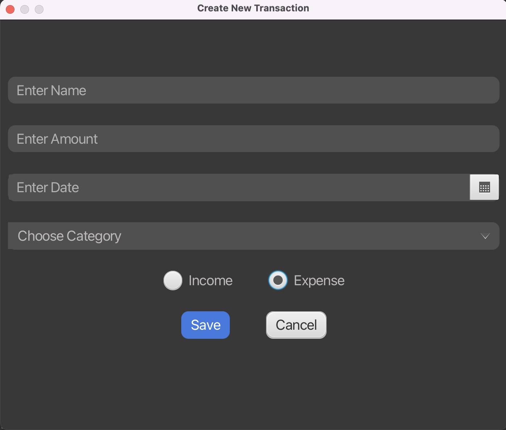
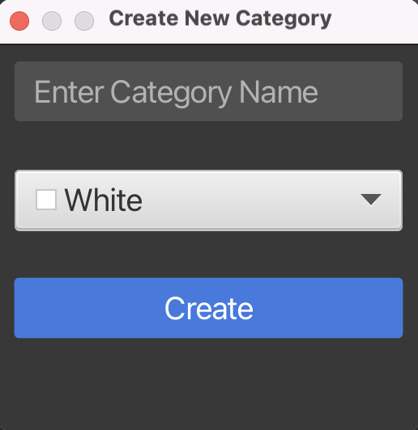
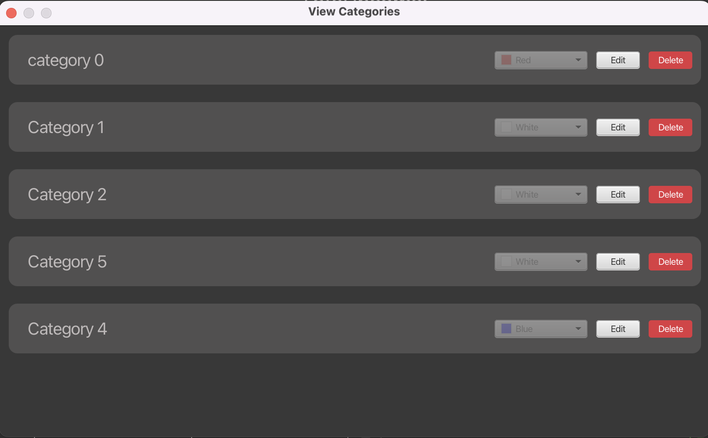

# 💰 Smart Spend - Personal Expense Tracker

[](https://www.oracle.com/java/)
[](https://spring.io/projects/spring-boot)
[](https://openjfx.io/)
[](LICENSE)

A powerful, full-stack desktop application for tracking personal finances with an intuitive user interface and robust backend architecture. Built with modern Java technologies to demonstrate enterprise-level software development practices.

---

## 📸 Screenshots

### Login/Registration screens



### Dashboard with balance summary


### Transaction management interface

### Category management views



---

## 🌟 Key Features

### User Management
- **Secure Authentication** - User registration and login system
- **Email Validation** - Built-in email format validation using Apache Commons Validator
- **User Profile Management** - Track user creation dates and account information

### Transaction Management
- **CRUD Operations** - Full create, read, update, and delete functionality for transactions
- **Transaction Categorization** - Organize expenses and income by custom categories
- **Transaction Types** - Support for both income and expense tracking
- **Date Tracking** - Record transaction dates with precise timestamp logging
- **Pagination Support** - Efficiently handle large transaction histories with paginated API responses

### Category System
- **Custom Categories** - Create personalized expense/income categories
- **Color Coding** - Visual identification with customizable color schemes
- **Category Management** - Full CRUD operations for transaction categories
- **User-Specific Categories** - Each user maintains their own category library

### Dashboard & Analytics
- **Balance Summary** - Real-time display of current balance, total income, and total expenses
- **Recent Transactions** - Quick view of latest financial activities
- **Responsive UI** - Adaptive layout with custom CSS styling

---

## 🏗️ Architecture & Design

### Backend Architecture (Spring Boot)

```
src/
├── controllers/          # REST API endpoints
│   ├── UserController
│   ├── TransactionController
│   └── TransactionCategoryController
│
├── services/            # Business logic layer
│   ├── UserService
│   ├── TransactionService
│   └── TransactionCategoryService
│
├── repositories/        # Data access layer (JPA)
│
├── models/             # JPA entities
│   ├── User
│   ├── Transaction
│   └── TransactionCategory
│
├── DTO/                # Data Transfer Objects
│
└── exceptions/         # Custom exception handling
│
└── repositories/       # repositories
│
└──ExpenseTrackerApplicatoin.java # main app
```

### Frontend Architecture (JavaFX)

```
src/
├── animations/
│   └── LoadingAnimationPane
│
├── components/
│   ├── CategoryComponent
│   └── TransactionComponent
│
├── controllers/
│   ├── DashboardController
│   ├── LoginController
│   └── SignUpController
│
├── dialogs/
│   ├── CreateNewTransactionCategoryDialog
│   ├── CreateOrEditTransactionDialog
│   ├── CustomDialog
│   ├── ViewChartDialog
│   ├── ViewOrEditTransactionCategoryDialog
│   └── ViewTransactionDialog
│
├── models/
│   ├── MonthlyFinance
│   ├── Transaction
│   ├── TransactionCategory
│   └── User
│
├── utils/
│   ├── ApiUtil        # HTTP client for backend communication
│   ├── SqlUtil        # Data operations wrapper
│   ├── Utility        # contains application constants
│   └── ViewNavigator  # Scene management
│
├── views/              # JavaFX UI components
│   ├── LoginView
│   ├── SignUpView
│   └── DashboardView
└── JavaFXApplication.java
```


---

## 🔧 Technology Stack

### Backend
| Technology | Purpose |
|------------|---------|
| **Spring Boot 3.x** | Core framework for REST API development |
| **Spring Data JPA** | Object-relational mapping and database operations |
| **Hibernate** | JPA implementation for entity management |
| **Lombok** | Reduce boilerplate code with annotations |
| **Jakarta Validation** | Input validation and data integrity |
| **MySQL/PostgreSQL** | Relational database (configurable) |

### Frontend
| Technology | Purpose |
|------------|---------|
| **JavaFX 23** | Rich desktop UI framework |
| **GSON** | JSON parsing and serialization |
| **Apache Commons Validator** | Email and input validation |
| **Custom CSS** | Styled UI components |

### Development Tools
- **Maven** - Dependency management and build automation
- **Git** - Version control
- **Postman/Insomnia** - API testing (recommended)

---

## 📋 Prerequisites

Before running this application, ensure you have:

- **Java Development Kit (JDK) 25 or higher**
- **Maven 3.8+**
- **MySQL 8.0+** or **PostgreSQL 14+**


---

## 🚀 Installation & Setup

### 1. Clone the Repository
```bash
git clone https://github.com/AbdullahAbdelaziz122/smart-spend-expense-tracker.git
```

### 2. Database Setup

#### MySQL Configuration
```sql
CREATE DATABASE expense_tracker;
CREATE USER 'expense_user'@'localhost' IDENTIFIED BY 'your_password';
GRANT ALL PRIVILEGES ON expense_tracker.* TO 'expense_user'@'localhost';
FLUSH PRIVILEGES;
```

### 3. Backend Configuration

Navigate to `backend/src/main/resources/application.properties`:

```properties
# Database Configuration
spring.datasource.url=jdbc:mysql://localhost:3306/expense_tracker
spring.datasource.username=expense_user
spring.datasource.password=your_password

# JPA Configuration
spring.jpa.hibernate.ddl-auto=update
spring.jpa.show-sql=true
spring.jpa.properties.hibernate.dialect=org.hibernate.dialect.MySQLDialect

# Server Configuration
server.port=8080
```

### 4. Build & Run Backend
```bash
cd backend
mvn clean install
mvn spring-boot:run
```

The backend API will be available at `http://localhost:8080`

### 5. Configure Frontend

Update `frontend/src/main/java/org/example/utils/ApiUtil.java` if needed:

```java
private static final String SPRINGBOOT_URL = "http://localhost:8080";
```

### 6. Build & Run Frontend
```bash
cd frontend
mvn clean javafx:run
```

---

## 📡 API Documentation

### User Endpoints

#### Register User
```http
POST /api/v1/user/register
Content-Type: application/json

{
  "name": "John Doe",
  "email": "john@example.com",
  "password": "securePassword123"
}
```

#### Login
```http
POST /api/v1/user/login
Content-Type: application/json

{
  "email": "john@example.com",
  "password": "securePassword123"
}
```

#### Get User by ID
```http
GET /api/v1/user/{userId}
```

#### Get User by Email
```http
GET /api/v1/user?email=john@example.com
```

---

### Transaction Endpoints

#### Create Transaction
```http
POST /api/v1/transaction
Content-Type: application/json

{
  "name": "Grocery Shopping",
  "amount": 125.50,
  "type": "EXPENSE",
  "date": "2024-01-15",
  "userId": 1,
  "categoryId": 3
}
```

#### Get User Transactions
```http
GET /api/v1/transaction/{userId}
```

#### Get Recent Transactions (Paginated)
```http
GET /api/v1/transaction/recent/user/{userId}?page=0&size=5
```

#### Update Transaction
```http
PUT /api/v1/transaction
Content-Type: application/json

{
  "id": 10,
  "name": "Updated Transaction",
  "amount": 150.00,
  "type": "EXPENSE",
  "date": "2024-01-16",
  "categoryId": 4
}
```

#### Delete Transaction
```http
DELETE /api/v1/transaction/{transactionId}
```

---

### Category Endpoints

#### Create Category
```http
POST /api/v1/transaction-category
Content-Type: application/json

{
  "userId": 1,
  "categoryName": "Food & Dining",
  "categoryColor": "FF5733"
}
```

#### Get User Categories
```http
GET /api/v1/transaction-category/user/{userId}
```

#### Update Category
```http
PUT /api/v1/transaction-category
Content-Type: application/json

{
  "categoryId": 5,
  "categoryName": "Updated Category Name",
  "categoryColor": "00FF00"
}
```

#### Delete Category
```http
DELETE /api/v1/transaction-category/{categoryId}
```

---

## 🗄️ Database Schema

### User Table
```sql
CREATE TABLE user (
    id BIGINT PRIMARY KEY AUTO_INCREMENT,
    name VARCHAR(255) NOT NULL,
    email VARCHAR(255) NOT NULL UNIQUE,
    password VARCHAR(255) NOT NULL,
    created_at DATE NOT NULL
);
```

### Transaction Category Table
```sql
CREATE TABLE transaction_category (
    id BIGINT PRIMARY KEY AUTO_INCREMENT,
    user_id BIGINT NOT NULL,
    category_name VARCHAR(255) NOT NULL,
    category_color VARCHAR(50) NOT NULL,
    FOREIGN KEY (user_id) REFERENCES user(id) ON DELETE CASCADE
);
```

### Transactions Table
```sql
CREATE TABLE transactions (
    id BIGINT PRIMARY KEY AUTO_INCREMENT,
    name VARCHAR(255) NOT NULL,
    amount DOUBLE NOT NULL,
    transaction_date DATE,
    created_at DATETIME NOT NULL,
    type VARCHAR(50),
    user_id BIGINT NOT NULL,
    category_id BIGINT NOT NULL,
    FOREIGN KEY (user_id) REFERENCES user(id) ON DELETE CASCADE,
    FOREIGN KEY (category_id) REFERENCES transaction_category(id)
);
```

---

## 🎨 Design Patterns Implemented

### Backend Patterns
- **MVC (Model-View-Controller)** - Separation of concerns in REST API
- **Repository Pattern** - Data access abstraction with Spring Data JPA
- **Service Layer Pattern** - Business logic encapsulation
- **DTO Pattern** - Data transfer between layers
- **Dependency Injection** - Using Spring's IoC container
- **Exception Handling** - Global exception handling with custom exceptions

### Frontend Patterns
- **MVC Pattern** - Separation of UI, controllers, and models
- **Singleton Pattern** - ViewNavigator for scene management
- **Utility Pattern** - Helper classes for common operations
- **Observer Pattern** - JavaFX property bindings and listeners

---

## 🔒 Security Considerations

### Current Implementation
- ✅ Input validation on both frontend and backend
- ✅ Custom exception handling for error management
- ✅ Email format validation
- ✅ User-category ownership verification

### Recommended Enhancements
- 🔧 **Password Hashing** - Implement BCrypt for secure password storage (noted in TODO comments)
- 🔧 **JWT Authentication** - Add token-based authentication for API security
- 🔧 **HTTPS/TLS** - Enable secure communication in production
- 🔧 **Input Sanitization** - Additional XSS and SQL injection prevention
- 🔧 **Rate Limiting** - Protect against brute force attacks

---

<!-- ## 🧪 Testing

### Running Tests
```bash
# Backend unit tests
cd backend
mvn test

# Integration tests
mvn verify
```

### Test Coverage Areas
- Service layer business logic
- API endpoint responses
- Data validation
- Exception handling -->

---

## 📈 Future Enhancements

### Planned Features
- [ ] **Data Visualization** - Charts and graphs for spending patterns
- [ ] **Budget Management** - Set monthly/category budgets with alerts
- [ ] **Recurring Transactions** - Automated tracking of subscriptions
- [ ] **Export Functionality** - PDF/Excel reports generation
- [ ] **Multi-Currency Support** - Handle international transactions
- [ ] **Search & Filters** - Advanced transaction filtering
- [ ] **Mobile App** - React Native or Flutter companion app
- [ ] **Cloud Deployment** - AWS/Azure hosting with CI/CD pipeline

### Technical Improvements
- [ ] Password encryption (BCrypt)
- [ ] JWT-based authentication
- [ ] Redis caching for performance
- [ ] Docker containerization
- [ ] Comprehensive test coverage (80%+)
- [ ] API documentation with Swagger/OpenAPI
